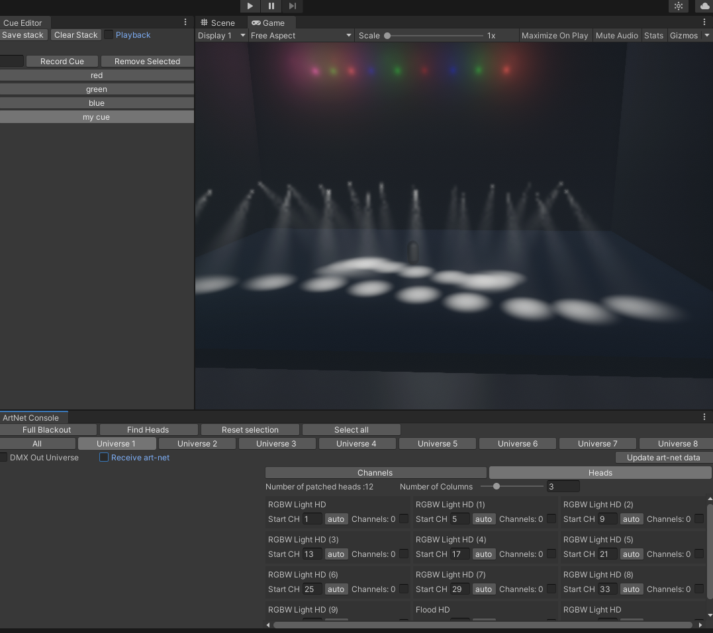

# DMX tools for Unity

Set of tools to simplify the workflow of controlling virtual and practical lights in Unity3D. Support for ArtNet in and USB DMX out. Could be used for the in-camera VFX virtual productions, live events and interactive installations.

Unity Package:
* https://github.com/igolinin/DMXtools/blob/main/DMXtools.unitypackage

Manual:
* https://github.com/igolinin/DMXtools/blob/main/Manual.pdf

Please help me to improve it and answer my survey questions.
* https://forms.gle/XU2afDxmDEdb6Jya7

Short demo videos
* https://youtube.com/playlist?list=PL6xzYzjDDu9vg6JiDnled-qhuY9fVBOm6

Inspired by these pieces of code:

* https://github.com/MikeCodesDotNET/ArtNet.Net
* https://github.com/sugi-cho/ArtNet.Unity
* https://github.com/davivid/Unity-DMX
* https://github.com/Wason-Fok/Unity-DMX-Fixture-Library